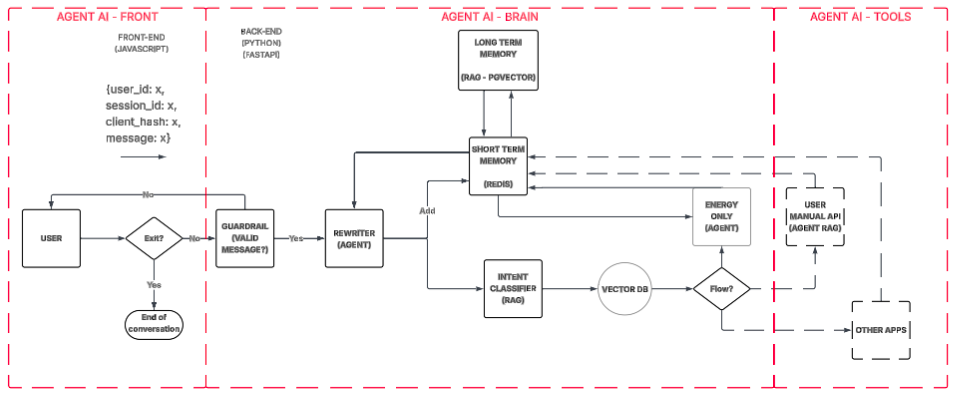

# Agent AI API

Multi-agent LLM agent API developed with FastAPI, designed to process user queries through an intelligent pipeline of specialized agents with a two-layer memory system.

## 📋 Table of Contents

- [About the Project](#about-the-project)
- [Architecture](#architecture)
- [Technologies](#technologies)
- [Prerequisites](#prerequisites)
- [Installation](#installation)
- [Configuration](#configuration)
- [Running the Project](#running-the-project)
- [Project Structure](#project-structure)
- [API Endpoints](#api-endpoints)
- [Memory System](#memory-system)
- [Agents](#agents)
- [Docker and Kubernetes](#docker-and-kubernetes)
- [Development](#development)

## 🎯 About the Project

Agent AI Agent API is a natural language processing platform that uses multiple specialized agents to process and respond to user queries. The system implements:

- **Multi-Agent Pipeline**: Different specialized agents for each processing stage
- **Two-Layer Memory**: Short-term memory (Redis) and long-term memory (PostgreSQL with pgvector)
- **Embedding Search**: Relevant context retrieval using embeddings
- **Cost Tracking**: Detailed monitoring of tokens and API costs

## 🏗️ Architecture

The system processes queries through the following pipeline:

1. **Input Guardrail**: Validates and filters inappropriate messages
2. **Rewriter**: Rewrites user queries for greater clarity
3. **Embedding Search**: Searches for similar documents to provide context
4. **Intent Classifier**: Classifies the query intent and routes to the appropriate specialized agent
5. **Tool Agent**: Executes the appropriate specialized agent based on intent classification:
   - **User Manual**: For documentation queries
   - **Energy Only**: For general energy queries
   - **Device Alarms**: For querying device alarm information

Each stage uses shared memory (short and long-term) to maintain conversational context.



## 🛠️ Technologies

### Backend
- **FastAPI** (0.115.6): Modern and fast web framework
- **Python** (3.12+): Programming language
- **SQLAlchemy** (<2): ORM for database
- **Alembic**: Database migration tool

### LLM and AI
- **LangChain** (0.3.20): Framework for LLM applications
- **LangChain OpenAI** (0.3.9): OpenAI integration
- **OpenAI API**: GPT-4o-mini models and embeddings

### Database
- **PostgreSQL**: Relational database
- **pgvector**: Extension for vector search
- **Redis**: Cache and short-term memory

### Infrastructure
- **Docker & Docker Compose**: Containerization
- **Kubernetes**: Container orchestration
- **Uvicorn**: ASGI server

## 📦 Prerequisites

- Python 3.12 or higher
- Docker and Docker Compose
- OpenAI account with configured API key
- Git (for private dependencies)

## 🔧 Installation

1. **Clone the repository**:
```bash
git clone <repository-url>
cd agent_api
```

2. **Install dependencies using UV** (recommended):
```bash
# Install UV if you don't have it yet
curl -LsSf https://astral.sh/uv/install.sh | sh

# Install dependencies
uv sync
```


3. **Configure environment variables**:
Create a `.env` file in the project root:
```env
# OpenAI
OPENAI_API_KEY=your_openai_api_key_here

# Database
DB_HOST=localhost
DB_PORT=5432
DB_USER=postgres
DB_PASSWORD=password
DB_DATABASE=agent_ai

# Redis
REDIS_URL=redis://localhost:6379

# External APIs
ALARMIMG_WTG_API=http://localhost:5000/api/alarms  # External alarm API endpoint
```

## ⚙️ Configuration

### Agent Configuration

Agents are configured in the `agent_ai/config/agent_config.json` file:

```json
{
    "brain_agents": {
        "input_guardrail": {
            "model": "gpt-4o-mini",
            "enabled": true,
            "temperature": 0.2
        },
        "rewriter": {
            "model": "gpt-4o-mini",
            "enabled": true,
            "temperature": 0.2
        },
        "intent_classifier": {
            "model": "gpt-4o-mini",
            "enabled": true,
            "temperature": 0.0,
            "structured_output": "IntentClassifier",
            "structured_output_mode": "json_schema"
        }
    },
    "tool_agents": {
        "energy_only": {
            "model": "gpt-4o-mini",
            "enabled": true,
            "temperature": 0.5
        },
        "user_manual": {
            "model": "gpt-4o-mini",
            "enabled": true,
            "temperature": 0.3
        },
        "device_alarms": {
            "model": "gpt-4o-mini",
            "enabled": true,
            "temperature": 0.0,
            "structured_output": "AlarmQuery",
            "structured_output_mode": "json_schema"
        }
    },
    "embeddings": {
        "model": "text-embedding-3-small",
        "dimensions": 1536
    },
    "short_term_memory": {
        "memory_size": 10,
        "link": "redis://localhost:6379"
    },
    "long_term_memory": {
        "rag_search_k": 3
    }
}
```

## 🚀 Running the Project

### 1. Start infrastructure services

```bash
# Start PostgreSQL and Redis
make database_up

# Or using docker-compose directly
docker-compose up -d
```

### 2. Configure the database

```bash
# Create tables using Alembic
make create-table

# Or directly
alembic upgrade head
```

### 3. Populate the database (optional)

```bash
make populate-db

# Or directly
python3 database/populate_db.py
```

### 4. Start the API

```bash
# Using makefile
make run-api

# Or directly
uvicorn server:app --port 8000 --reload
```

The API will be available at:
- **API**: http://localhost:8000
- **Swagger Documentation**: http://localhost:8000/docs

### Available Makefile Commands

```bash
# Database
make database_up          # Start PostgreSQL and Redis
make database_down        # Stop and remove containers
make create-table         # Run migrations
make populate-db          # Populate database with initial data

# Individual services
make db_agent_ai_up      # Start only PostgreSQL
make db_agent_ai_down    # Stop PostgreSQL
make redis_agent_ai_up   # Start only Redis
make redis_agent_ai_down # Stop Redis

# API
make run-api              # Start development server
```

## 📁 Project Structure

```
agent_api_v2/
├── alembic/                    # Database migrations
│   ├── versions/               # Migration versions
│   └── env.py                  # Alembic configuration
├── database/                   # Database population scripts
│   └── populate_db.py
├── db_agent_ai/               # SQLAlchemy models
│   └── agent/
│       ├── agent_knowledge_embeddings.py
│       └── long_term_memory.py
├── agent_ai/                  # Main agent logic
│   ├── agent/
│   │   ├── agent_builder.py    # Agent manager
│   │   └── embedding_search.py # Embedding search
│   ├── config/
│   │   └── agent_config.json   # Agent configuration
│   ├── memory/
│   │   └── memory_manager.py   # Memory managers
│   ├── prompts/                # Agent prompts
│   │   ├── device_alarms.txt
│   │   ├── energy_only.txt
│   │   ├── input_guardrail.txt
│   │   ├── intent_classifier.txt
│   │   ├── rewrite_query_by_memory.txt
│   │   └── user_manual.txt
│   └── utils/                  # Utilities
├── docker/                     # Docker files
│   └── Dockerfile
├── kubernetes/                 # Kubernetes manifests
│   ├── deployment.yaml
│   ├── ingress.yaml
│   └── service.yaml
├── server/                     # FastAPI application
│   ├── api/
│   │   ├── agent_ai_brain/
│   │   │   └── v1/
│   │   │       └── agent_ai_brain.py
│   │   ├── user_manual_tool/
│   │   │   └── v1/
│   │   │       └── user_manual_tool.py
│   │   ├── device_alarms_tool/
│   │   │   └── v1/
│   │   │       └── device_alarms_tool.py
│   │   ├── dependencies/       # Dependencies (DB, settings)
│   │   └── routes.py            # Main routing
│   ├── core/                   # Core configurations
│   │   ├── logger.py
│   │   ├── middlewares.py
│   │   └── settings.py
│   ├── schemas/                 # Pydantic schemas
│   │   └── reference.py
│   └── __init__.py              # FastAPI application
├── templates/                   # HTML templates
│   └── index.html
├── tests/                       # Tests
├── docker-compose.yml           # Service orchestration
├── makefile                     # Helper commands
├── pyproject.toml               # Project configuration
└── README.md                    # This file
```

## 🔌 API Endpoints

### POST `/v1/agent_ai_brain`

Main endpoint that processes messages through the complete agent pipeline.

**Request Body**:
```json
{
    "user_id": "string",
    "session_id": "string",
    "client_hash": "string",
    "message": "string"
}
```

**Response**:
```json
{
    "response": "string",
    "tokens_prompt": 0,
    "tokens_completion": 0,
    "tokens_total": 0,
    "cost_usd": 0.0
}
```

### POST `/v1/user_manual`

Endpoint for specific queries about user documentation.

**Request Body**:
```json
{
    "user_id": "string",
    "session_id": "string",
    "client_hash": "string",
    "context": "string",
    "message": "string"
}
```

**Response**:
```json
{
    "response": "string",
    "tokens_prompt": 0,
    "tokens_completion": 0,
    "tokens_total": 0,
    "cost_usd": 0.0
}
```

### POST `/v1/device_alarms`

Endpoint for querying device alarm information. This endpoint extracts device name and date information from natural language queries and retrieves alarm data from an external API.

**Request Body**:
```json
{
    "user_id": "string",
    "session_id": "string",
    "client_hash": "string",
    "message": "string"
}
```

**Response**:
```json
{
    "response": "string",
    "tokens_prompt": 0,
    "tokens_completion": 0,
    "tokens_total": 0,
    "cost_usd": 0.0
}
```

**Functionality**:
1. Uses the `device_alarms` agent to extract structured information (device name and date) from natural language queries
2. Queries an external alarm API with the extracted parameters
3. Filters and formats the alarm data for presentation
4. Returns formatted alarm information including component details, status, and threshold violations

## 🧠 Memory System

### Short-Term Memory (Redis)

- Stores the last N messages of the conversation
- Configurable TTL (default: 600 seconds)
- Shared among all agents in the same session
- Key: `user:{user_id}:session:{session_id}`

### Long-Term Memory (PostgreSQL + pgvector)

- Stores all messages with embeddings
- Embedding search using cosine similarity
- Allows retrieval of context from previous conversations
- HNSW indexing for efficient search

**Table**: `agent.long_term_memory`

## 🤖 Agents

### Brain Agents

#### Input Guardrail
- **Function**: Validates and filters inappropriate messages
- **Model**: gpt-4o-mini
- **Temperature**: 0.2
- **Memory**: Not used

#### Rewriter
- **Function**: Rewrites queries for greater clarity
- **Model**: gpt-4o-mini
- **Temperature**: 0.2
- **Memory**: Uses long-term memory

#### Intent Classifier
- **Function**: Classifies user queries into specific intents for routing to appropriate tool agents
- **Model**: gpt-4o-mini
- **Temperature**: 0.0
- **Structured Output**: Returns JSON with `intent` and `confidence` fields
- **Memory**: Not used
- **Intents Classified**:
  - `user_manual`: For documentation and product-related queries
  - `energy_only`: For general energy concepts and educational queries
  - `device_alarms`: For operational queries about device alarms

### Tool Agents

#### Energy Only
- **Function**: Responds to general energy queries
- **Model**: gpt-4o-mini
- **Temperature**: 0.5
- **Memory**: Uses long-term memory

#### User Manual
- **Function**: Answers questions about documentation
- **Model**: gpt-4o-mini
- **Temperature**: 0.3
- **Context**: Uses context from retrieved documents
- **Memory**: Does not use history memory

#### Device Alarms
- **Function**: Extracts device name and date information from natural language queries for alarm retrieval
- **Model**: gpt-4o-mini
- **Temperature**: 0.0
- **Structured Output**: Returns JSON with `device_name` and `end_time` fields
- **Memory**: Uses long-term memory
- **External Integration**: Queries external alarm API with extracted parameters

### Intent Classification and Routing Logic

The intent classifier follows specific rules to determine the appropriate agent:

1. **`user_manual` intent** (selected when):
   - Query is about product functionality or operation
   - Mentions business rules or alarm generation rules
   - Discusses prediction logic, thresholds, or internal conditions
   - Asks about system or dashboard behavior

2. **`energy_only` intent** (selected when):
   - Query is explanatory or conceptual
   - Educational content about renewable energy
   - General energy topics independent of specific products or systems
   - No mention of specific devices, products, or internal rules

3. **`device_alarms` intent** (selected when):
   - Query explicitly requests to list or consult alarms
   - Asks about alarms on a specific day or period
   - Mentions alarms for real machines, devices, or equipment
   - **Important**: Only for operational/historical queries, not conceptual explanations

**Routing Priority Rules**:
- If device alarms are mentioned → `device_alarms`
- If dashboard, product, or business rules are mentioned → `user_manual`
- If topic is general and product-independent → `energy_only`
- In case of ambiguity → Choose safest intent with reduced confidence

## 🐳 Docker and Kubernetes

### Docker

The project includes a multi-stage `Dockerfile` for production:

```bash
# Build image
docker build -t agent-api:latest .

# Run container
docker run -p 8000:8000 agent-api:latest
```

### Docker Compose

The `docker-compose.yml` includes:
- **PostgreSQL with pgvector**: Main database
- **Redis Stack**: Cache and short-term memory

### Kubernetes

Kubernetes manifests are available in `kubernetes/`:
- `deployment.yaml`: Application deployment
- `service.yaml`: Service to expose the application
- `ingress.yaml`: Ingress for external routing

## 💻 Development

### Running Tests

```bash
pytest tests/
```

### Database Migrations

```bash
# Create new migration
alembic revision --autogenerate -m "migration description"

# Apply migrations
alembic upgrade head

# Revert migration
alembic downgrade -1
```

### Adding a New Agent

1. Add the configuration in `agent_ai/config/agent_config.json`
2. Create the prompt in `agent_ai/prompts/{agent_name}.txt`
3. The agent will be automatically loaded by `AgentManager`

### Logs

The project uses `loguru` for logging. Logs are configured with:
- Level: INFO (configurable)

## 👥 Contributors

[Osmar Alexandre do Amaral Neto]
